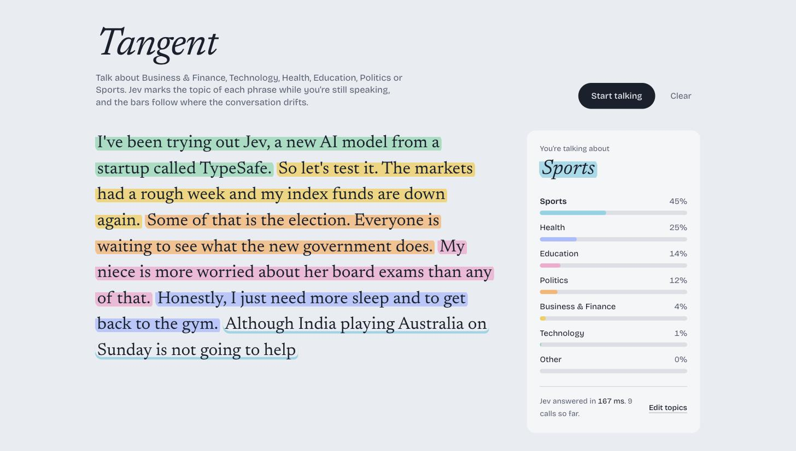

# Tangent

Talk, and watch every phrase get highlighted by its topic while you're still speaking.

Tangent streams your voice through **ElevenLabs Scribe v2 Realtime** and sends each phrase to **Jev**, TypeSafe AI's decision model, which answers "which topic is this?" with a probability for every topic in a few hundred milliseconds. The highlight can change mid-sentence, and the bars on the right follow where the conversation drifts.

**Live demo:** [tangent-jev.vercel.app](https://tangent-jev.vercel.app)



## How it works

```
microphone ──► ElevenLabs Scribe v2 Realtime ──► partial + final transcripts
                                                        │
                                                        ▼
                         /api/topic ──► Jev (via OpenRouter) ──► one topic + probabilities
                                                        │
                                                        ▼
                                  highlight the phrase, update the topic bars
```

- **Live transcription.** The browser gets a single-use token from `/api/scribe-token` and streams the mic to Scribe v2 Realtime. Scribe returns partial text as you speak and commits a phrase when you pause.
- **Classification while you talk.** Every time the partial text changes (debounced to ~220 ms), the phrase is sent to Jev as one `choice` question, together with the two previous phrases for context. Newer requests cancel older ones, so the highlight always reflects the latest words.
- **Typed answers, not text.** Jev returns the chosen topic plus a probability for every option. The probabilities drive the bars, smoothed so they drift instead of jump.
- **Your own topics.** Visitors can replace the default topics (up to 7, plus a built-in "Other") from the **Edit topics** panel. Topics live only in that browser tab.
- **Nothing is stored.** There is no database. Transcripts exist only in the page.

## Stack

- [Next.js](https://nextjs.org) (App Router) and React, styled with Tailwind CSS
- [ElevenLabs Scribe v2 Realtime](https://elevenlabs.io/realtime-speech-to-text) via `@elevenlabs/react`
- [Jev](https://openrouter.ai/~typesafe/jev-latest) by TypeSafe AI, called through [OpenRouter](https://openrouter.ai) with the AI SDK's `experimental_evaluate` and `@ai-sdk/typesafe-ai`
- [Vercel](https://vercel.com) for hosting and Web Analytics

## Run it locally

You need Node.js 22 or newer and two API keys:

| Variable | Where to get it |
|---|---|
| `ELEVENLABS_API_KEY` | [ElevenLabs → API keys](https://elevenlabs.io/app/settings/api-keys). Needs speech-to-text access. |
| `OPENROUTER_API_KEY` | [OpenRouter → Keys](https://openrouter.ai/settings/keys). Set a credit limit on the key; see [Cost](#cost). |

```bash
git clone https://github.com/padmanabhan-r/Tangent-JEV.git
cd Tangent-JEV
npm install
cp .env.example .env.local   # then paste your two keys into .env.local
npm run dev
```

Open [http://localhost:3000](http://localhost:3000), press **Start talking** and allow the microphone. No mic? Type into the box under the transcript and press Enter; it goes through the same pipeline.

## Deploy to Vercel

```bash
npm i -g vercel
vercel link
vercel env add ELEVENLABS_API_KEY production
vercel env add OPENROUTER_API_KEY production
vercel deploy --prod
```

Hosting runs on Vercel's free Hobby plan. To see visitors by country, referrer and device, open your project's **Analytics** tab in the Vercel dashboard and enable Web Analytics; the `<Analytics />` component is already in `app/layout.tsx`.

## Customising topics

- **In the app:** press **Edit topics**, name up to 7 topics and add a few words of description for each (descriptions help Jev tell similar topics apart). Presets for News, Startup and Sports are one click away.
- **Defaults and presets:** edit `PRESETS` in `lib/topics.ts`. The first preset is the default.

Tip: avoid topics that overlap heavily (for example "Finance" and "Business" as separate topics). Jev will split its probability between them and the highlight will flicker.

## Cost

Jev on OpenRouter costs about **$0.042 per million input tokens**, and output is free. A Tangent call is roughly 400 input tokens, so:

| Usage | Approximate cost |
|---|---|
| One classification | $0.000017 |
| 10 minutes of continuous talking (~1,500 calls) | $0.025 |
| $2 of credit | ~118,000 calls |

Give your OpenRouter key a spending limit. When it's reached, the app shows "Jev stopped: the OpenRouter key has reached its spending limit" instead of failing silently. The `/api/topic` route also limits each visitor to 240 calls a minute. ElevenLabs transcription is billed to your ElevenLabs account per minute of audio.

## Project structure

```
app/
  api/scribe-token/route.ts   single-use ElevenLabs Scribe token
  api/topic/route.ts          validates topics and asks Jev for the topic of a phrase
  layout.tsx                  fonts, metadata, Vercel Analytics
components/
  Tangent.tsx                 transcript, topic panel, start popup, type-instead box
  TopicEditor.tsx             the Edit topics dialog
lib/
  useTangent.ts               mic → Scribe → Jev pipeline and smoothing
  topics.ts                   presets, validation, colours
  rateLimit.ts                per-visitor rate limiting
```
